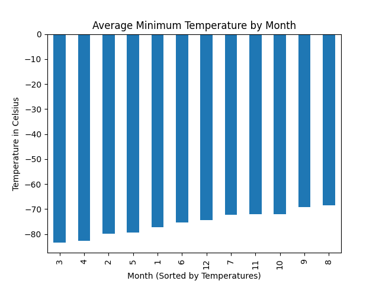
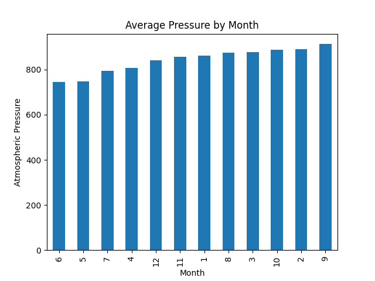
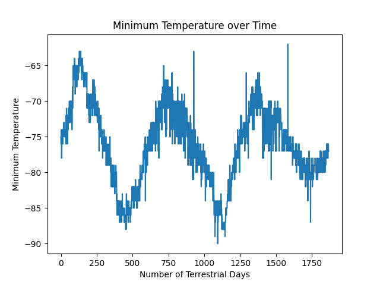

# Webscraper Challenge - MarsUpdate
`Module 5`  
`EdX(2U) & UT Data Analytics and Visualization Bootcamp`  
`Cohort UTA-VIRT-DATA-PT-11-2024-U-LOLC`  
**By:** Neel Kumar Agarwal  

## Table of Contents
1. [Introduction](#introduction)  
2. [Challenge Overview](#challenge-overview)  
3. [Deliverables](#deliverables)  
4. [Setup and Usage](#setup-and-usage)  
   - [Prerequisites](#prerequisites)  
   - [Instructions](#instructions)  
   - [Limitations](#limitations)  
5. [Files and Directory Structure](#files-and-directory-structure)  
6. [Expected Results](#expected-results)  
7. [Analysis](#analysis)  
   - [Scraping Titles and Text (Part 1)](#scraping-titles-and-text-part-1)  
   - [Scraping and Analyzing Weather Data (Part 2)](#scraping-and-analyzing-weather-data-part-2)  
   - [Embedded Analysis Discussion](#embedded-analysis)  
8. [Citations / References](#citations--references)  

---

## Introduction
In this challenge, we use **Splinter** (for browser automation) and **BeautifulSoup** (for HTML parsing) to:
1. **Scrape Titles and Preview Text** of the latest Mars news articles.
2. **Scrape and Analyze Mars Weather Data** (temperature and pressure readings) from a static webpage.  

Both tasks are performed in Jupyter notebooks so that code, outputs, and analytical commentary can be intermixed in one file.

---

## Challenge Overview
1. **Deliverable 1**: Scrape Titles and Preview Text from Mars News  
   - Access a static Mars news site using Splinter.  
   - Parse the HTML elements with BeautifulSoup.  
   - Collect the article titles and previews, store them in dictionaries, then print your final list.  

2. **Deliverable 2**: Scrape and Analyze Mars Weather Data  
   - Access a static Mars facts site using Splinter.  
   - Parse the HTML table to extract data (Martian day, temperature, atmospheric pressure, etc.).  
   - Convert to a Pandas DataFrame, clean the data types, produce summary statistics, and visualize results.  
   - Export your final DataFrame to a CSV file.  
   - Provide short commentary on the findings for the coldest months, pressure fluctuations, and approximate length of a Martian year.

[:arrow_up: Return to TOC](#table-of-contents)  

---

## Deliverables
1. **part_1_mars_news.ipynb**  
   - A Jupyter notebook for scraping the Mars news site for article titles and teasers.  
   - Stores results in Python data structures and prints them out.  

2. **part_2_mars_weather.ipynb**  
   - A Jupyter notebook that scrapes the Mars temperature/pressure data site, analyzes it in Pandas, and visualizes results.  
   - Includes **inline commentary** on the results.  

3. **README.md**  
   - Explains the project goals, usage instructions, and final outcomes.

[:arrow_up: Return to TOC](#table-of-contents)  

---

## Setup and Usage

### Prerequisites
- **Python 3.x**  
- **Anaconda** or another environment manager that supports Jupyter notebooks.  
- **Pandas** and **Matplotlib**: install via `pip install pandas matplotlib` or `conda install pandas matplotlib`.  
- **Splinter** library: `pip install splinter`  
- **BeautifulSoup**: `pip install beautifulsoup4`  
- A compatible **web driver** for Splinter (e.g., **ChromeDriver**) that is accessible via PATH or an absolute path.


### Instructions
1. **Clone this repository** (or download its `.ipynb` files).  
2. **Create or activate a conda environment**:
   ```bash
   conda create --name mars_env python=3.9
   conda activate mars_env
   ```
3. **Install dependencies**:
   ```bash
   pip install splinter beautifulsoup4 pandas matplotlib
   ```
4. **Launch Jupyter Notebook**:
   ```bash
   jupyter notebook
   ```
5. **Open `part_1_mars_news.ipynb`** and run all cells:
   - This will automate a browser session to the Mars News site.  
   - It will parse the HTML, extract article titles and previews, and display them in your notebook output cells.

6. **Open `part_2_mars_weather.ipynb`** and run all cells:
   - This will automate a browser session to the Mars facts site.  
   - It will scrape the data table, load into a Pandas DataFrame, visualize monthly temperature/pressure, and produce final CSV output (`mars_data.csv`).  
   - Check the markdown cells labeled for “Analysis” to see commentary on findings.


### Limitations
- **Static scraping**: Only tested against the provided static pages. Changes to these pages may break the script.  
- **Driver setup**: Must ensure ChromeDriver or your chosen driver is in PATH.  
- **Notebook**: Code must be run in an environment that supports Jupyter Notebook or JupyterLab.

[:arrow_up: Return to TOC](#table-of-contents)  

---

## Files and Directory Structure
```
webscraper-challenge/
│
├── MarsUpdate/
│   │
│   ├── Figures/ (Optionally created)
│   │   ├── avgTemp_ByMonth.png
│   │   ├── avgAtm_byMonth.png
│   │   └── temp_byTime.png
│   │
│   ├──mars_data.csv (Exported by part_2_mars_weather.ipynb)
│   │
│   ├── part_1_mars_news.ipynb
│   └── part_2_mars_weather.ipynb
│
├── .gitignore  
├── README.md
```

[:arrow_up: Return to TOC](#table-of-contents)  

---

## Expected Results
**part_1_mars_news.ipynb**  
- Displays a list of dictionaries where each dictionary has:
   ```python
   {
      'title': 'Some Mars Article Title',
      'preview': 'Preview text snippet for that article...'
   }
   ```

**part_2_mars_weather.ipynb**  
- Displays a **Pandas DataFrame** of Martian weather data in the notebook.  
- Produces bar charts summarizing average min temperature and average pressure by month.  
- Shows a line plot of daily min temps over time to estimate the length of a Martian year.  
- Outputs `mars_data.csv` as a clean data file.  
- Markdown cells contain commentary on the average minimum temperatures per moth, the average pressures per month, and rough calculation for how many Earth days are in a Martian year.  
- Bar Charts:
   +   
   +   
   + 

[:arrow_up: Return to TOC](#table-of-contents)  

---

## Analysis

### Scraping Titles and Text (Part 1)
**Brief Summary**  
1. **Site Visitation**: Splinter automates a Chrome browser to go to the static Mars News site.  
2. **HTML Parsing**: BeautifulSoup locates each article container.  
3. **Data Extraction**: Title and preview snippet are stored in a dictionary.  
4. **Output**: The final list is displayed in the notebook.


### Scraping and Analyzing Weather Data (Part 2)
**Brief Summary**  
1. **Site Visitation**: Splinter visits the static Mars Temperature data page.  
2. **Table Parsing**: BeautifulSoup extracts rows (`<tr>`) and cells (`<td>`).  
3. **DataFrame Creation**:  
   - Columns: `id`, `terrestrial_date`, `sol`, `ls`, `month`, `min_temp`, `pressure`.  
   - Converted columns to correct data types.  
4. **Exploratory Analysis**:  
   - Summary stats.  
   - Visual analysis with bar charts.  
   - Identify the coldest/hottest months and lowest/highest pressure months.  
   - Identify average pressures per month and statistically relevant data.  
   - Estimate Earth days in a Martian year using temperature data.  
5. **CSV Export**: The final dataset is written to `mars_data.csv`.


### Embedded Analysis
- **Coldest/Hottest Months:**  
   > The minimum temperatures for Mars are quite low in comparison to our standard Earth temperatures, but they do follow some basic rules as per their planet. Primarily, the temperatures fluctuate from approximately -83.3 degrees celsius to -68.3 degrees celsius, centering around -75.5 degrees. While there are only 12 data points for the 12 months in the graph, those points come from aggregating by averages, and thus the standard deviation holds a lot of meaning in that the values are not incredibly spread far apart. From the graph, it can be seen that the first 6 months are in fact the hottest in terms of minimum temperatures. It does also seem to operate in a single cycle. 

- **Lowest/Highest Pressure Months:**  
   > Atmospheric pressure actually functions in two cycles, with a much larger dispersement in terms of standard deviation (55.5), however atmospheric pressure values are normally quite large. In this case, Mars' pressure extremes are approximately 745 and 913.3, with a mean of 841.5. The lowest low occurs in month 6, whereas the highest high occurs in month 9. 

- **Length of a Martian Year:**  
   > Finding the length of a Martian year by the guided/described method uses the visual aid of plotting minimum temperatures with consecutively counted days terrestrial (Earth) days. By matching the cyclical pattern in Mars' temperature cycles it's possible to calculate an approximate Martian year in Earth days.  If taken like a typical wave, the year is simply one wavelength, or the total days divided by the number of wavelengths. In this case, it could either be found by visually finding one single cycle which looks to be around 625 terrestrial days. However, for an average, the total axis length could be taken as 1875 / 3, which would also come out at 625 terrestrial days! Thus validating the result a little more.

[:arrow_up: Return to TOC](#table-of-contents)  

---

## Citations / References
- **Starter Data**: Provided via edX/2U’s Module 11 resources.  
- **README.md**: Created using OpenAI's [ChatGPT LLM](https://www.chatgpt.com), trained using prior READMEs from project owner and sole contributor's repository [Neel Agarwal (Neelka96)](https://www.github.com/Neelka96), the two deliverables, and the provided rubric given by edX/2U  
- **BeautifulSoup Documentation**: [https://www.crummy.com/software/BeautifulSoup](https://www.crummy.com/software/BeautifulSoup)  
- **Splinter Documentation**: [https://splinter.readthedocs.io/en/latest/](https://splinter.readthedocs.io/en/latest/)  
- **Chrome WebDriver**: [https://chromedriver.chromium.org](https://chromedriver.chromium.org)  

[:arrow_up: Return to TOC](#table-of-contents)  